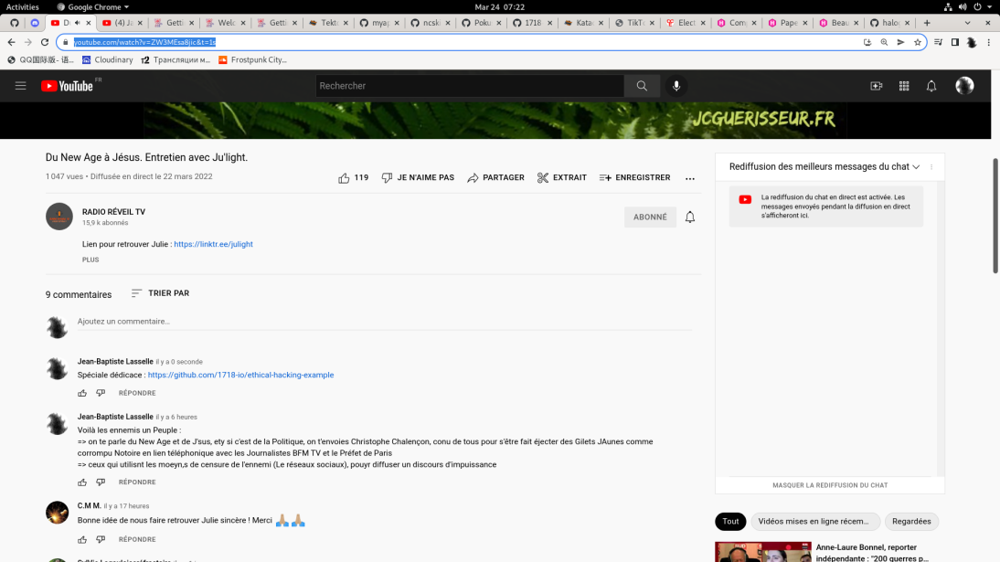
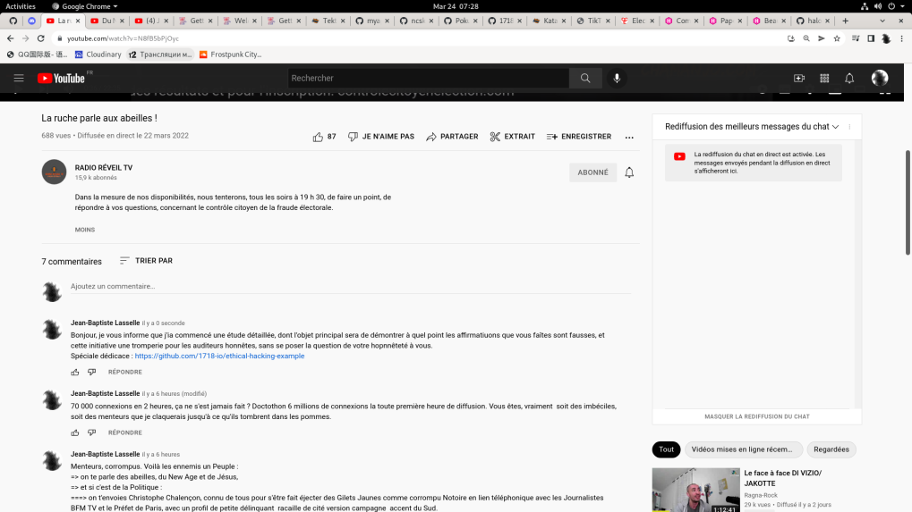

# Avez-vous entendu parler de  https://controlecitoyenelection.com/  ?

* Dans [cette vidéo YouTube](https://www.youtube.com/watch?v=wbJ3pvV0-xc&t=2537s), les tenants de l'infrastructure derrière le site internet https://controlecitoyenelection.com/ :
  * décrivent le mécanisme par lequel ils prétendant fournir aux Français, un moyen de contre -èvérificatiuon du résultat des électtions
  * vous trouverez dans ces explications, un nombre simplemnt affolant de contre-vérités, de non-sens et d'absurdités littéralement incroyables, là où la même époque se penche sur des tehcnologies comme la blockchain ou la cryptographie ZKP (Zero Knowledge Proof) pour mettre en oeuvre de tels systèmes de vérification de l'intégrité d'un vote.
* Dans [cette vidéo YouTube](https://www.youtube.com/watch?v=N8fB5bPjOyc&t=33s), les tenants de l'infrastructure derrière "":
  * expliquent que le serveur `STMP` "est tombé": ce serveur est utilisé pour envoyer des emails de confirmation, dans le process d'inscription ("registration")
  * expliquent qu'un site internet recevant 70 000 connexions par heure "cela ne s'est jamais vu" : ridicule affirmation, y compris parmiu les "citoyens résistants", plsuieurs ont déjà monté des sites internet prenant des charges beaucoup plus importantes (j'ai personnellement vécu jusqu'à plusieurs millions de connexions par heure)

Le diffuseur de ce contenu est connu sur les réseaux sociaux sous le sobriquet de "`Chamanjo`".

Et pendant que les algorithmes des réseaux sociaux permettent de diffuser massivement à es dizaines de milliers de Citoyens Français honnêtes, ces informations au minimum complètement fausses et stupides, il n'existe aucun professionnel de notre métier, pour venir explique rationnellement au Citoyen Français, ce qu'il est parfaitement capable de comprendre.

Dans cette situation, et face à la colère initiale homérique, qui a été la mienne, j'ai décidé d'adopter l'arme de la Plume, et de l'Esprit, pour défaire l'ennemi de l'ignorance, et défendre l'Honneur de mes concitoyens Français, tous capables de la plus haute forme d'Intelligence, et du rafinement parmi les plus appréciés au Monde.

Pour l'Honneur de l'Esprit Humain.

Ainsi, ma démarche consistera à cultiver mon jardin (apprendre), tout en réalisant mon devoir de citoyen.

* Dans ce document, nous apprendrons donc :
  * À nous servir de multiples outils de sécurité, tels que `OpenDoor`
  * À mettre en oeuvre un cycle devops pour la gestion de la scurité : nous concevrons un cycle "DevSecOps"
  * À mettre en oeuvre une pratique de "Ethical Hacking":
    * Dès le début de ce travail (cf. date du premier commit sur `master`), avant même de découvrir la moindre vulnérabilité, j'informerai par envoi d'email, messages sur réseaux sociaux, le fameux "Chamanjo", ainsi que les tenants légaux de l'infrastructure derrière le site internet ""
    * À chaque vulnérabilité découverte :
      * J'enverrai un message de mise en deumeure aux tenants de l'infrastructure derrirère https://controlecitoyenelection.com/  , afin d'informer la plateforme de la vulnérabilmité découverte, et en donnant les solutions pour se protéger de la vulnérabilité
      * Dans tous les cas, 6 heures après la découverte de la vulnérabilité, la vulénrabilité sera intégralement publiqment publiée dans ce repo, avec moyena automatisé de reproduire une attaque exploitant la vumlnérabilité découverte.
      * Pour chaque vulnérabilité découverte, si les tenants derrière le site https://controlecitoyenelection.com/  , m'envoient un email ou ouvrent une issue sur Github dans ce repo, pour me demander d'attendre avant de publier la vulnérabilité, j'allongerai le délai de 6 heures, d'autant nécessaire pour résoudre le problème de sécurité.


J'ai enfin pu noter que d'autres "Collectifs connus", comme Réinfo Covid, "suivent de près" cette initiative.

À chaque vulnérabilité découverte, j'informerai donc aussi ces différents collectifs, après le délai de 6 heures échu.

## Le principal problème

Selon moi, le principal problème que pose l'initiative derrière https://controlecitoyenelection.com/ est le suivant:

* On prétend que cet "outil" permettrait de vérfier le résultat d'une élection comme l'ection présidentielle française.
* Mon but principal sera d'apporter la démonstration qu'au contraire de ce qui est affirmé à des dizaines de milliers de français sur les rseaux sociaux, cet "outil" ne permet en aucun cas de véfrfier le moindre résultat d'uen quelconque élection, et en particulier pas pour l'élection présidentielle Française.

## Techie

Okay now let's dive into serious stuff, first, i need a proper documentation to publish results of my study, and make it available to the non-technical reader (the everyday citizen) : that's gonna be a hugo static website, deployed to github pages.

### Working with the Github Pages static website

* the hugo website source code will be in the `documentation/hugo` folder
* the hugo website will be published to Github pages, in the `docs/` folder on `master` git branch, and source code will be in the `documentation/hugo` folder.


##### Run locally the hugo website

```bash

```


##### Deploy PR branches for the hugo website

We use surge.sh

```bash

```


##### Deploy the hugo website to Github Pages


```bash

```


##### How the hugo website source code was initialized


```bash
mkdir -p documentation/hugo/
git clone git@github.com:1718-io/ethical-hacking-example.git documentation/hugo/
cd documentation/hugo/
git checkout monkey/tests-integration

rm -fr ./.git/

npm run clean


```


## ANNEX A. `OpenDoor` Cheatsheet

To run OWASP security scanner with default dictionnaries, wordlists, and rainbows :

```bash
opendoor  --reports json,html --reports-dir radiojaune.com --host https://controlecitoyenelection.com
opendoor  --reports json,html --reports-dir radiojaune.com --host https://tekton.dev
opendoor  --reports json,html --reports-dir radiojaune.com --host https://kubernetes.io
```

## ANNEX B. Contributor's Cheatsheet


```bash
git add -A && git commit -m "finishing hugo project setup" && git push -u origin HEAD
```


## ANNEX C. Echanges avec l'équipe gérant https://controlecitoyenelection.com/elysee2022/ Team (Communications to the https://controlecitoyenelection.com/elysee2022/ Team)

### Par la chaîne Yotube de "`Chamanjo`"


#### Le Jeudi 24 Avril 2022, `07:36` le matin (Thursday, the 24th of April 2022, `07:36 am`)




#### Le Jeudi 24 Avril 2022, `16:22` - après-midi (Thursday, the 24th of April 2022, `4:22 pm`)

Je retourne sur la page où j'ai laissé le commentaire initial, pour informer l'équipe du début de mon travail en donnant l'URL du repository Github


#### Le Jeudi 24 Avril 2022, `19:41` - soir (Thursday, the 24th of April 2022, `7:41 pm`)

Je retourne sur la page où j'ai laissé le commentaire un seconde fois, après une première censure, et je constate que mon commentaire a à nouveau été censuré.

Je le poste une troisième fois, pour que l'équipe soit informée du début de mon travail en donnant l'URL du repository Github :


Le texte du commentaire / message que j'ai laissé : ccc


#### Le Jeudi 24 Avril 2022, `20:41` - soir (Thursday, the 24th of April 2022, `20:41 pm`)

Le `YouTuber` "`Chamanjo`" était en diffusion Live Streaming, a proposé aux auditeurs de passer en direct, en communiquant le lien StreamYard.

J'ai pu dire quelques mots en tant sque citoyen, et en ai profité pour évoquer la problématique que je traite ici.

J'ai proposé de présenter publiquement mes excuses, pour les propos insultants que j'ai tenu sous l'effet de la colère, dans mes premiers commentaires YouTube.

Suite à quoi j'ai été invité à venir dans une prochaine émission pour venir en discuter en live, avec les tenants du projet "derrière" https://controlecitoyenelection.com/

Désormais, il sera donc probablement possible de communiquer à l'équipe, totues les vulnérabilités découvetes, avant leur publication.

Cette expérience va donc techniquement, tout autant que politiquement, devenir intéressante. Un réel enjeu, un réel intérêt technique.

Mon échange oral, bien maladroit, et spontané, lors de la diffusion live avec "`ChamanJo`" et les participants de l'émission : https://www.youtube.com/watch?v=x5NVOURqros&t=3595s

Suite : je vais poursuivre la découverte des vulnérabilités en gardant confidentielles celles-ci, jusqu'au prochain échange avec l'équipe.


#### Le Vendredi 25 Avril 2022, `21:09` - soir (Friday, the 25th of April 2022, `21:09 pm`)

Je trouve une nouvelle publication concernant ce projet de contrôle citoyen des élections: https://www.youtube.com/watch?v=9NOPcjTuEPU

Dans cette diffusion, les tenants du projet font un rapide état de l'avancement du projet, à destination du grand public.

Je n'ai pas été invité pour cette diffusion.

Il s'avère que cette diffusion a eut lieu avant la diffusion à laquelle j'ai participé le Jeudi 24 Mars 2022.


#### Le Mardi 29 Mars: un nouveau tournant

J'ai aujourd'hui été invité dans une diffusion livestream, qui a été extrêment plaisante et encourageante.

Le projet a des besoins immédiat, de scallabilité, pour "que ça tienne quand des dizaines de miliers de photos seront evoyées par des téléphone smobiles (pour les enregistremnts de PV de bureaux de vote)

J'ai donc proposé d'aider pour changer l'infrastructure, et je vais donc déployer l'ensemble du site web dans un cluster Kubernetes. SI j'en ai le temps, je ferais un opérateur FluxCD.


https://www.youtube.com/watch?v=vGvQrcfLSLg&t=814s

https://alibaba.com;, terraform / pulumi helm chart :
* goal 1 : to deploy a web app which connects to a MySQL DataBase, so with a statefulset for the MySQL CLuster at least. Examples :
  * https://medium.com/linuxworld-informatics-pvt-ltd/helm-is-a-tool-to-manage-applications-within-kubernetes-4f730ef11ec9
* goal 2 : instead opf the WordPress webapp, we must deploy the acutal source code of the website
* goal 3 : THis web app must be scallable, and have authentication. Authentication module might have to be changed, to be able to scale up.
* goal 4 : kick ouit MySQL and replace by MariaDB


BOM :
* I need an example wordpess app,
* I need the helm chart for the example wordpress app
* I need the source coe of the actual website
* I need a pipeline to run all the standard operations of the infrastructure :
  * the reation of the infrastructure : pulumi / terraform
  * backup / restore of database (so i need the scripts, but well i think they already got that) : backup must happen every hour ?
  *
